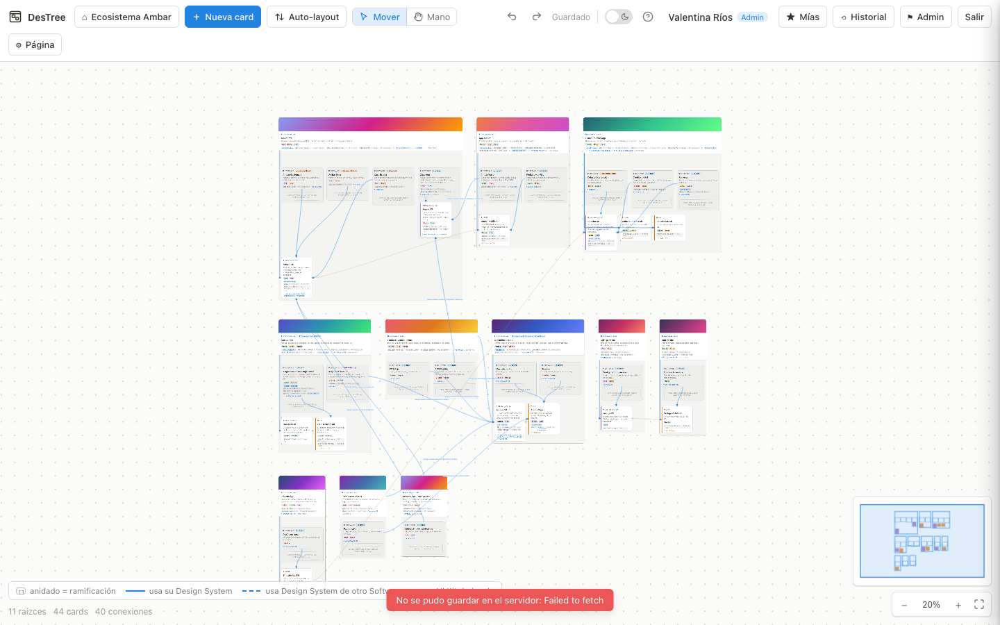
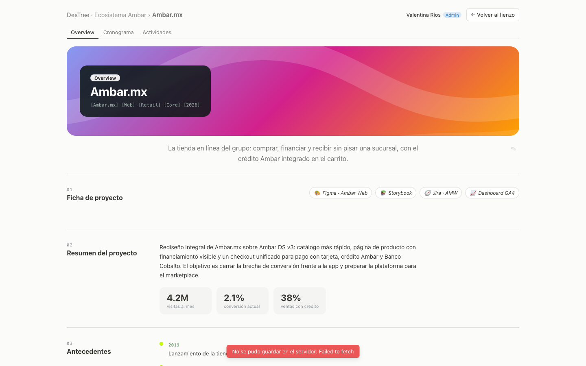
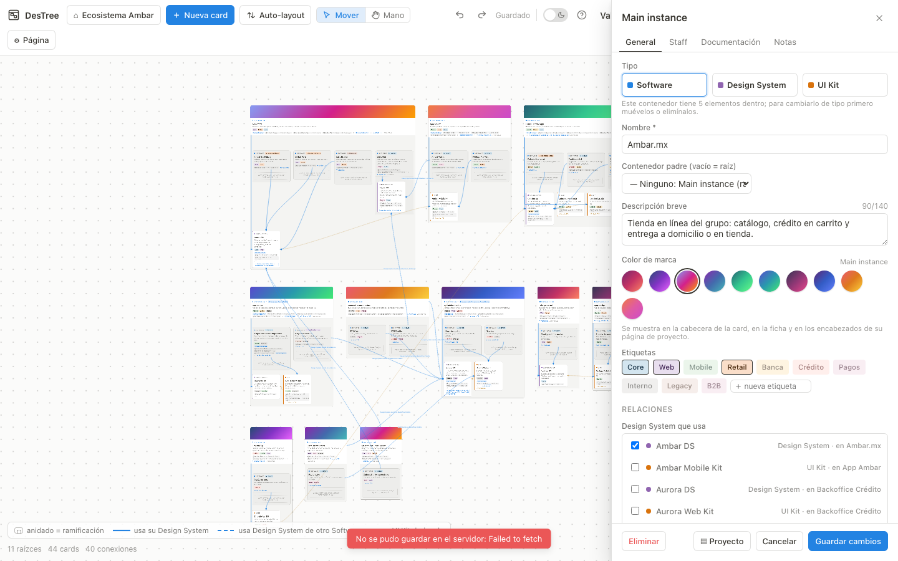
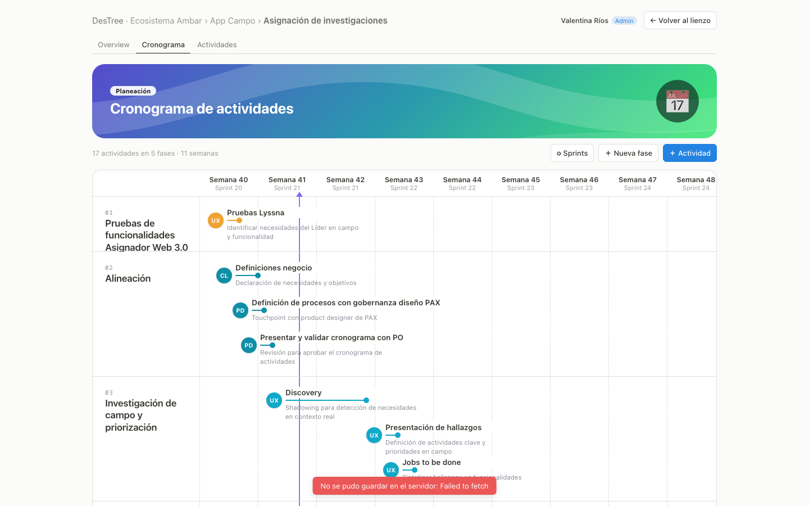
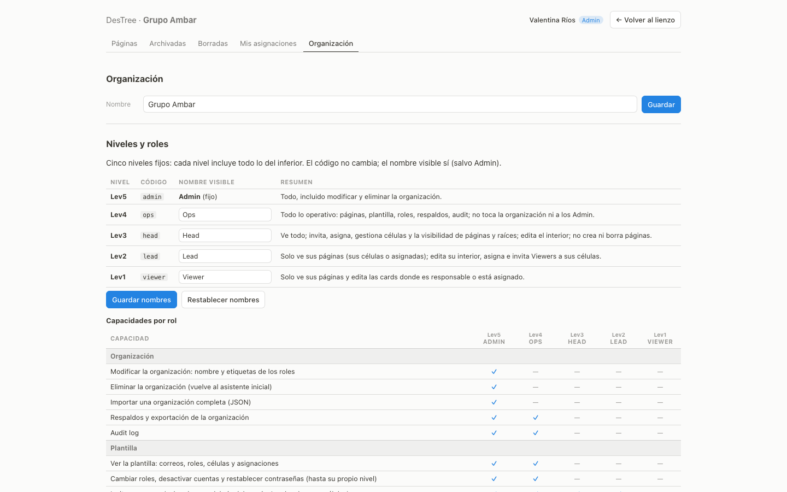
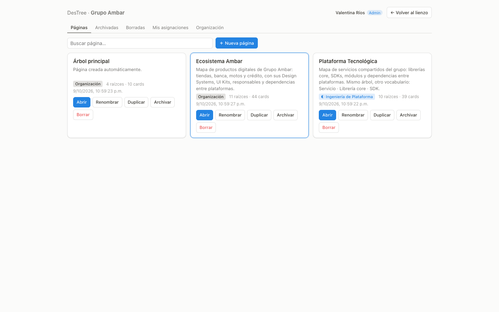

# DesTree

🇪🇸 [Versión en español](README.md)

Single source of truth for agencies and product teams: a canvas with the **software tree** (applications → features → variants), their **Design Systems and UI Kits**, owners, teams (cells), documentation, project pages and versions. Self-hosted, multi-page, with five role levels (Admin · Ops · Head · Lead · Viewer).

- **Canvas**: nested containers (branches), DS and UI Kits inside each software, "uses DS" and "derives from" connections, tags, brand color per Main instance, auto-layout, minimap, undo/redo.
- **Project page per card**: Overview with editable sections (links, summary with metrics, background, users, problem statement, goals, deliverables, team), a Schedule by phases and weeks, and a Kanban board of activities (To Do · Doing · Done · Cancelled).
- **Team**: cells with members; roots and pages visible to the whole organization or only to certain cells; owner and assignees per card; Viewers see what is theirs and edit only their own cards.
- **Organization**: five fixed levels with configurable display names, staff list with roles and assignments, capabilities table, invitations by link or email (optional SMTP), password reset, audit log.
- **Documentation**: links (Figma, Notion, repos…) and markdown notes per card; safe images (WebP + thumbnail); a 1920×1080 PNG thumbnail of each Main instance to use as a Figma cover.
- **History**: automatic and manual versions per page, diff and restore; schedulable tar.gz backups; organization export/import; demo data with one command.
- **No heavy dependencies**: Node 22 + Fastify 5 + SQLite (`node:sqlite`), vanilla ESM client without a bundler. Only native dependency: `sharp`.

> No Figma integration (API, metrics, webhooks): the app is complete without it. Links to Figma files are added by hand under Documentation and the thumbnail is copied and pasted.

## At a glance
Screenshots taken on the demo data (fictional organization "Grupo Ambar").
| Canvas | Project page | Instance sidebar |
|---|---|---|
|  |  |  |

| Schedule | Organization | Page lobby |
|---|---|---|
|  |  |  |

## Quick install (Docker)
```
git clone https://github.com/carlosfis/destree.git && cd destree
cp .env.example .env            # adjust PORT/DOMAIN if needed
docker compose up -d            # http://localhost:3000 → setup wizard (organization + admin)
```
`./data` holds the database, images and backups. `docker compose down && docker compose up -d` keeps everything. Automatic HTTPS: set `DOMAIN=your.domain` in `.env` and run `docker compose --profile https up -d`.

## Without Docker
```
npm ci && cp .env.example .env
npm run migrate      # creates data/destree.db
npm start            # http://localhost:3000
```
Requires Node ≥ 22.13. Behind a TLS proxy: `TRUST_PROXY=1`.

## Try it with demo data
```
node scripts/seed-demo.js --password=<password>
# Docker: docker compose exec destree node scripts/seed-demo.js --password=<password>
```
After the setup wizard, this loads a fictional organization: seven accounts (one per level, several Lead/Viewer), four cells and two complete pages with connections and project pages. Sign in with each account to see what changes per level; the accounts and what each one sees are listed in `docs/ADMIN.md` → "Datos demo" (Spanish). Everything can be deleted like any other page.

## Updating
Docker: `docker compose pull && docker compose up -d` (or `--build` if you cloned). Without Docker: `git pull && npm ci && npm start`. Migrations run automatically at startup; take a backup first (`npm run backup` or `#/admin → Respaldos`).

## Backup and restore
- Manual: `#/admin → Respaldos → Crear` (downloadable) or `npm run backup`. Scheduled: `BACKUP_CRON="30 3 * * *"` in `.env` (`BACKUP_KEEP` keeps the last N).
- Restore: with the server stopped, `node scripts/restore.js data/backups/destree-<date>.tar.gz` (Docker: `docker compose run --rm destree node scripts/restore.js /data/backups/<file>` with the service stopped). The previous data is kept in `data/restore-prev-<date>/`.
- Logical alternative: export/import the organization as JSON from `#/admin → Respaldos`.

## Roles
Five fixed levels; each level includes everything below it. The visible name of each role (except Admin) can be changed in `⌂ → Organización`, which also shows the full capabilities table.
| | Lev5 Admin | Lev4 Ops | Lev3 Head | Lev2 Lead | Lev1 Viewer |
|---|---|---|---|---|---|
| Modify / delete the organization, import an organization | ✓ | — | — | — | — |
| Create, rename, archive, delete and import pages | ✓ | ✓ | — | — | — |
| Staff (roles, deactivate, passwords), backups, audit log | ✓ | ✓ | — | — | — |
| See every page; page/root visibility; create cells; restore versions | ✓ | ✓ | ✓ | — | — |
| Edit the inside of visible pages, assign people, invite lower roles | ✓ | ✓ | ✓ | ✓ (own pages) | — |
| See pages of their cells or assigned; edit their own cards and their project page (owner or assignee) | ✓ | ✓ | ✓ | ✓ | ✓ |

## Documentation
Product docs are in Spanish (the UI language): `docs/INSTALL.md` (installation and variables) · `docs/ADMIN.md` (administration and demo data) · `docs/USER.md` (canvas and project page) · `docs/API.md` · `docs/SECURITY.md` (threat model and headers) · `docs/MAP.md` (code map) · `docs/DECISIONS.md` · `CONTRIBUTING.md` · `CODE_OF_CONDUCT.md` · `SECURITY.md` (reporting vulnerabilities) · `CHANGELOG.md` · `PENDIENTE.md` (detailed roadmap by phases).

## Roadmap
On `main`, upcoming 1.1.0: project page per card (Overview · Schedule · Kanban) · brand color on Main instances · five role levels and the Organization tab · Figma thumbnail · demo data. v1.0.0 brought passwords, SMTP mail, hardening (strict CSP), the English README and screenshots. Pending (details and status in `PENDIENTE.md`): reference deployment. Out of scope: Figma integration, SSO/OAuth; the UI is Spanish-only for now.

## License
MIT — see `LICENSE`.
